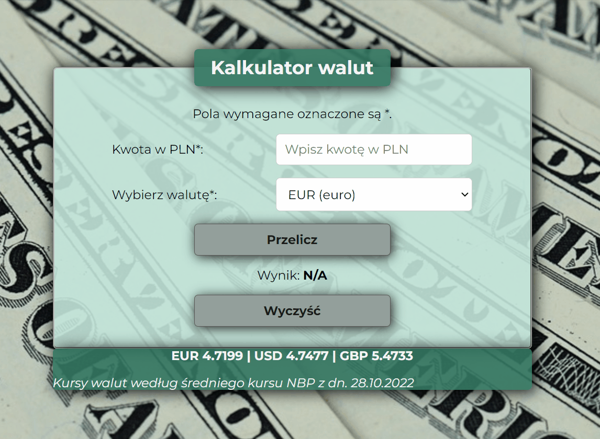

# Currency Conventer

## Demo
[See my Currency Conventer](https://justynaboesche.github.io/Currency-conventer/)
## Description
This is my second project created in the process of becoming the **Frontend Developer**. I have created a simple currency conventer that allows you to exchange Polish currency PLN into some other currencies.
## How it works
At the beginning you need to enter your amount of money in PLN, then you can select the currency from the list you want to convert into. To get the result, you need to click the 'Przelicz' button. If you want to reset the amount in PLN and the result, you can click the 'Wyczyść' button.  
[Click here](https://justynaboesche.github.io/Currency-conventer) and convert your amount of money in PLN into one of the selected currencies!

## Technologies used in the project
To create the application I have used:
- HTML
- CSS
- Normalize
- Flexbox
- BEM convention
- JavaScript
- ES6+ features
- GIT
- Markdown
